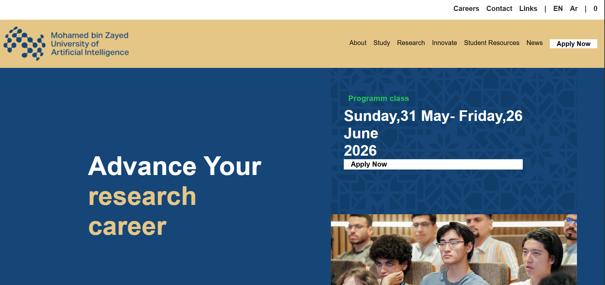

# 🎓 MBZUAI Website Clone – Hero Section

## 📌 Project Overview
This project is a frontend clone of the hero section from the official website of  
**Muhammad Bin Zayed University of Artificial Intelligence (MBZUAI)**.

The layout recreates the navigation bar, metrics section, and hero banner design using pure HTML and CSS.

⚠️ This project is created for educational and practice purposes only.

---

## 🛠 Technologies Used

- HTML5
- CSS3 (Internal Styling)
- Flexbox Layout

---

## 📂 Project Structure

```
project-folder/
│
├── index.html
├── logo.png
├── banner-bg-modal.png
├── students.png
└── docs/
    └── image.png
```

---

## 📸 Project Screenshot



---

## 🎯 Features

- Top navigation bar (Careers, Contact, Language switch)
- Secondary menu with Apply Now button
- Hero section with:
  - Large bold heading
  - Highlighted text styling
  - Background banner image
  - Overlay content (Program class + Date + Apply button)
- Flexbox based layout
- Clean spacing and structured sections

---

## 🚀 How to Run the Project

1. Download or clone the repository.
2. Make sure all images are placed correctly:
   - Main images in root folder
   - Screenshot inside `docs/` folder
3. Open `index.html` in your browser.

---

## 🎓 Inspired By

Muhammad Bin Zayed University of Artificial Intelligence (MBZUAI)  
Official Website: https://mbzuai.ac.ae/

---

## 👩‍💻 Author

Created for frontend layout practice and UI cloning exercise.
